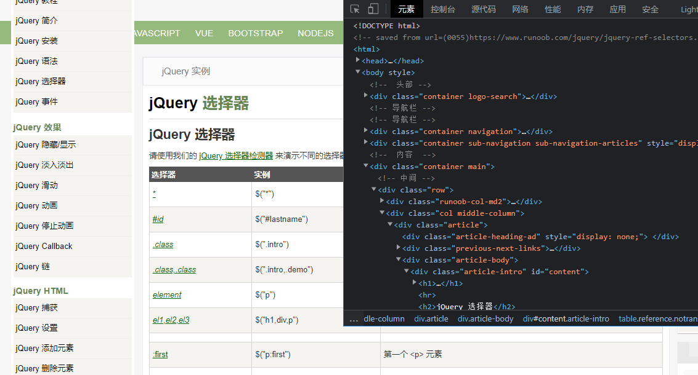
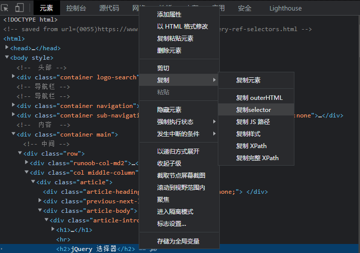

# TagHolder.select

*基于版本 0.4*

通过`selector`选择器来获取节点，使用方法很简单，只需3步：

1. 打开浏览器的开发者工具

   

2. 右键需要定位的元素，选择`复制selector`

   

3. 复制到`TagHolder.select`方法中

   ```java
   HtmlParser parser = new HtmlParser(file);
   TagNodeHolder holder = parser.parser();
   NodeLink link = holder.select("#content > h2");
   ```

------

请注意，目前版本只支持以下的selector标识：

* `标签名` - 定位子节点中的第一个同名节点
* `#id` - 定位所有子节点中的第一个`id`属性相同的节点
* `.class` - 定位子节点中的第一个`class`属性相同的节点
* `:first` - 定位第1个子节点
* `:last` - 定位最后1个子节点
* `:nth-child(n)` - 定位第`n`个子节点
* `:nth-last-child(n)` - 定位倒数第`n`个子节点